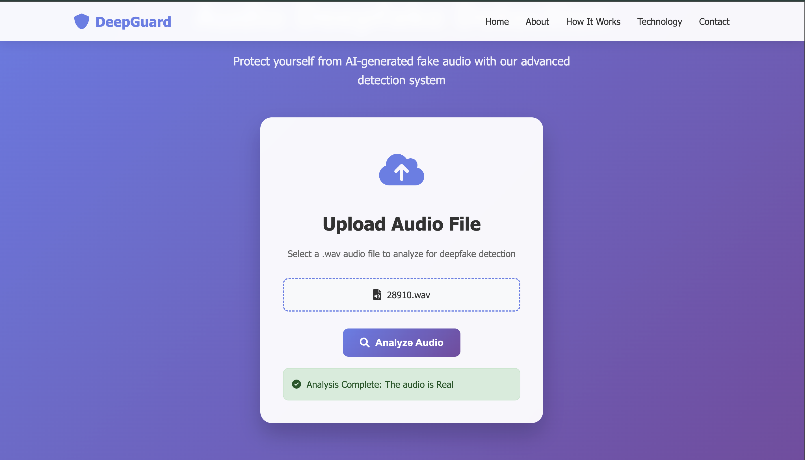
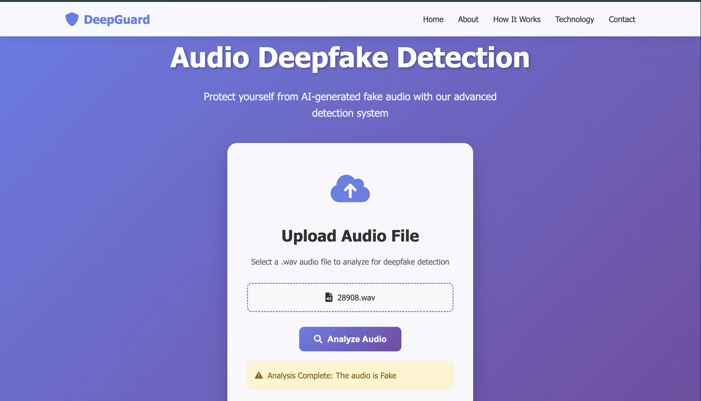
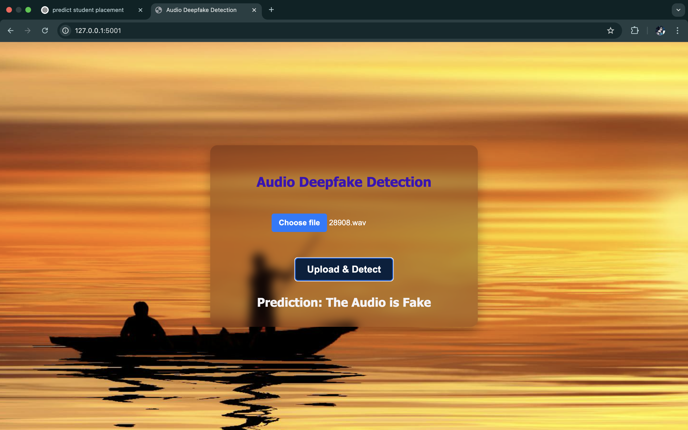

# 🎙️ Audio Deepfake Detection

This project aims to detect deepfake audio using machine learning. The model is trained to classify audio files as **Real** or **Fake** based on extracted Mel-Spectrogram features.

## 🚀 Features
- Upload an audio file (`.wav` format).
- The model predicts if the audio is **Real** or **Fake**.
- Uses a Flask-based REST API for real-time inference.

## 🖼️ Screenshots

> Home Page:

## The demo screenshot is old.., i'll update new screenshot soon.., still some update is remains.


> Click to select Audio File Page:



> Output Page:





------------------------------------------------------------------------------------------------------------------------------------------------------

## 📂 Project Structure


Audio-Deepfake-Detection/ │── uploads/ # Folder for uploaded audio files │── model.keras # Trained deepfake detection model │── app.py # Flask API for inference │── templates/ │ ├── index.html # Frontend UI for file upload │── static/ │ ├── style.css # Styling for UI │── requirements.txt # Required dependencies │── README.md # Project Documentation

## ⚙️ Setup & Installation
1. **Clone the repository**
   ```bash
   git clone https://github.com/dasmrpmunna/Audio-Deepfake-Detection.git
   cd Audio-Deepfake-Detection


2. Create a virtual environment (optional but recommended)
python -m venv venv
source venv/bin/activate  # On macOS/Linux
venv\Scripts\activate     # On Windows

3. Install dependencies
pip install -r requirements.txt

4. Run the Flask API
python app.py

5. Access the Web App Open your browser and go to:
http://127.0.0.1:5000

----------------------------------------------------------------------------------------------------------------------------------------------------------
🛠 Technologies Used

Python

Flask

TensorFlow/Keras

Librosa (for audio processing)

HTML/CSS/JavaScript (Frontend)


Note:

🔹 TensorFlow:
TensorFlow is an open-source machine learning framework developed by Google.
It is used to build, train, and deploy deep learning and machine learning models efficiently at scale.
It supports automatic differentiation, GPU/TPU acceleration, and works across platforms (desktop, mobile, cloud).

🔹 Keras:
Keras is a high-level deep learning API that runs on top of TensorFlow.
It simplifies model building by offering easy-to-use functions for creating and training neural networks.
Keras is beginner-friendly, modular, and supports rapid prototyping with less code.

✅ Summary of TensorFlow/Keras:
- TensorFlow is the backend engine; Keras is the user-friendly interface built on top of it.
- You use Keras to quickly design models, and TensorFlow handles the heavy computations underneath.

🔊 Librosa (for Audio Processing):
Librosa is a Python library used for analyzing and processing audio signals, especially in music and speech applications.
It provides easy tools to extract features like MFCCs, spectrograms, chroma, and more from .wav files or other audio formats.

✅ Key Features Librosa:
- Load and save audio files easily.
- Convert audio to spectrograms, MFCCs, and other formats.
- Perform tempo, pitch, and beat analysis.
- Useful in speech recognition, audio classification, and deepfake detection.

---------------------------------------------------------------------------------------------------------------------------------------------------------------

🏗 Future Improvements
Support for more audio formats (.mp3, .ogg, etc.).

Improve model accuracy with a larger dataset.

Deploy on cloud platforms (AWS/GCP).

🤝 Contributing
Feel free to fork this repository and contribute to the project!

📜 License
This project is open-source and available under the MIT License.


------------------------------------------------------------------------------------------------------------------------------------------------------------------

### 📌 **Final Step**  
Save the file, and now your `README.md` is ready! You can view it in **VS Code**, **GitHub**, or **Markdown viewers**.

Want me to improve it further or customize it for your needs? 🚀🔥

-------------------------------------------------------------------------------------------------------------------------------------------------------------------

## 📜 License
This project is licensed under the [MIT License](LICENSE).
