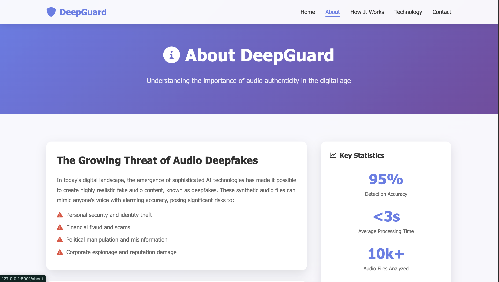

# 🎙️ Audio Deepfake Detection

This project aims to detect deepfake audio using machine learning. The model is trained to classify audio files as **Real** or **Fake** based on extracted Mel-Spectrogram features.

## 🚀 Features
- Upload an audio file (`.wav` format).
- The model predicts if the audio is **Real** or **Fake**.
- Uses a Flask-based REST API for real-time inference.

## 🖼️ Screenshots

> Home Page:

> Click to select Real Audio File and Detect Output:

> Click to select Fake Audio File and Detect:

> About Page:

> Technology Page:

> Contact Page:

------------------------------------------------------------------------------------------------------------------------------------------------------

